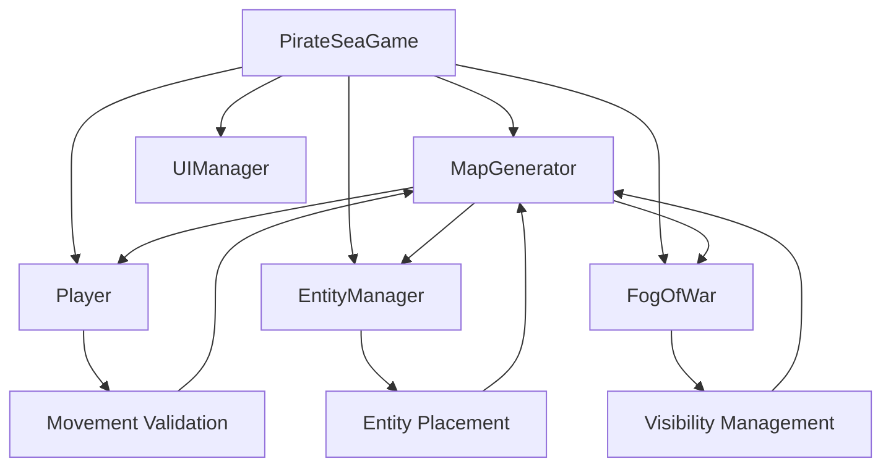
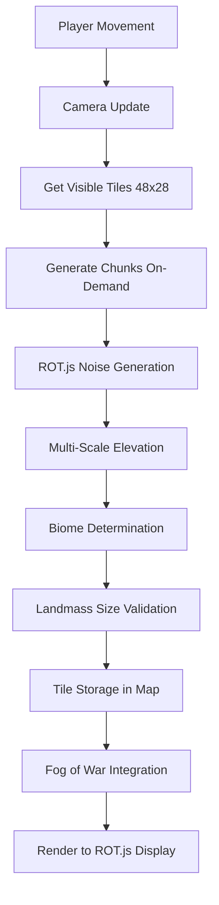

# Design Document

## Overview

The procedural map generation system creates infinite, explorable worlds for the pirate roguelike game using ROT.js-based noise terrain generation. The system employs a sparse storage architecture with on-demand chunk generation to support unlimited world exploration while maintaining optimal memory usage. The design integrates with the existing game systems (Player, EntityManager, FogOfWar, UIManager) and focuses on creating realistic 80% water coverage with 11 distinct biomes that support dual movement mechanics and ship boarding/unboarding at coastal areas.

## Architecture

### Core Components

The system is built around a `MapGenerator` class that manages world generation, biome assignment, camera tracking, and tile access. The architecture integrates with the existing pirate game systems:

- **Sparse Storage**: Uses JavaScript `Map` objects with string keys ("x,y") for O(1) tile access
- **ROT.js Integration**: Leverages ROT.Noise.Simplex() for deterministic noise generation
- **On-Demand Generation**: Generates world chunks only when needed via `generateChunkAt(x, y)`
- **Multi-Scale Noise**: Combines 4 noise layers (continental, island, atoll, chain) for realistic terrain
- **Camera System**: Tracks player position and manages 48x28 tile viewport
- **Ship Integration**: Supports coastal boarding/unboarding mechanics

### System Integration



### Data Flow



## Components and Interfaces

### MapGenerator Class

**Constructor Parameters:**
- `width`: Display width in tiles (default: 48)
- `height`: Display height in tiles (default: 28)

**Core Methods:**
- `generateMap()`: Initializes ROT.Noise.Simplex() generators and prepares the infinite world system
- `generateChunkAt(x, y)`: Generates or retrieves a tile at world coordinates with caching
- `updateCamera(playerX, playerY)`: Centers camera on player position for 48x28 viewport
- `getVisibleTiles()`: Returns array of tiles currently visible on screen with screen coordinates

**Movement Integration Methods:**
- `isWalkable(x, y, onShip)`: Validates movement for foot/ship modes using biome properties
- `getBiomeAt(x, y)`: Retrieves complete tile data for specific coordinates
- `getWalkableTiles(onShip, centerX, centerY, radius)`: Finds suitable tiles for entity placement

**Ship Mechanics Methods:**
- `isNavigableWater(x, y)`: Checks if ocean tile has sufficient water neighbors (≥3) for ship navigation
- `getWaterBodySize(x, y, visited, maxSize)`: Analyzes water body connectivity for ship placement

**Fog of War Integration:**
- `setVisibility(x, y, visible)`: Manages fog of war state and exploration tracking
- `clearVisibility()`: Resets visibility for all loaded tiles

**Configuration and Extensibility Methods:**
- `initializeBiomes()`: Validates and initializes biome configuration objects
- `addBiomeType(name, config)`: Allows runtime addition of new biome types
- `setGenerationParameters(params)`: Configures noise scales, thresholds, and water coverage
- `validateConfiguration()`: Ensures all biome definitions have required properties

**Development and Debugging Methods:**
- `getNoiseValues(x, y)`: Returns raw elevation, moisture, temperature values for debugging
- `analyzeBiomeDistribution(sampleSize)`: Calculates biome percentages across sample area
- `logGenerationStats()`: Outputs performance and distribution statistics to console

### Noise Generation System

**ROT.js Integration:**
- Uses `new ROT.Noise.Simplex()` for elevation, moisture, and temperature generation
- Requires rot-js npm package v2.2.0+ to be available globally as `ROT`

**Multiple Noise Layers:**
- **Continental Scale** (0.025): Large landmasses with >0.75 threshold, 1.8x multiplier
- **Island Scale** (0.12): Medium islands with >0.7 threshold, 1.3x multiplier  
- **Atoll Scale** (0.2): Small atolls with >0.75 threshold, 1.0x multiplier
- **Chain Scale** (0.06): Three chain patterns with varying thresholds (0.8, 0.85, 0.82)

**Noise Generators:**
- `elevationNoise`: Primary terrain height determination with base level 0.2
- `moistureNoise`: Climate moisture levels (0.09 scale, +100 offset)
- `temperatureNoise`: Climate temperature (0.07 scale, +200 offset)

### Biome Configuration System

**Biome Properties:**
- `char`: ASCII character for ROT.js display rendering
- `color`: Hex color code for visual distinction
- `walkable`: Boolean for foot movement validation
- `shipWalkable`: Boolean for ship movement validation

**Complete Biome Definitions:**
- Ocean (~, #2980b9): Ship-navigable water, not walkable on foot
- Beach (., #f39c12): Coastal transition zones, walkable on foot only
- Forest (♠, #229954): Standard walkable terrain, foot only
- Jungle (#, #27ae60): Dense walkable vegetation, foot only
- Desert (:, #e67e22): Arid walkable terrain, foot only
- Savanna (", #d35400): Grassland terrain, foot only
- Taiga (T, #2c3e50): Cold forest terrain, foot only
- Tropical (t, #e74c3c): Hot climate terrain, foot only
- Mountain (^, #7f8c8d): Impassable high elevation
- Snow (*, #ecf0f1): Impassable cold terrain
- Swamp (%, #16a085): Impassable wetland

**Biome Assignment Logic:**
The system uses a deterministic biome assignment algorithm based on elevation, moisture, and temperature thresholds:

1. **Ocean Assignment**: Elevation < 0.4 → Ocean biome (ship-navigable only)
2. **Beach Assignment**: Elevation 0.4-0.45 → Beach biome (coastal transition, foot-walkable)
3. **High Elevation Logic**:
   - Elevation > 0.9 AND temperature < 0.4 → Snow biome (impassable)
   - Elevation > 0.9 AND temperature ≥ 0.4 → Mountain biome (impassable)
4. **Climate-Based Assignment**:
   - Moisture < 0.15 AND temperature > 0.75 → Desert biome (foot-walkable)
   - Moisture > 0.85 AND temperature > 0.75 → Jungle biome (foot-walkable)
   - Moisture > 0.85 AND temperature ≤ 0.75 → Swamp biome (impassable)
5. **Default Terrestrial Biomes**: Forest, Savanna, Taiga, Tropical assigned based on remaining moisture/temperature combinations

This logic ensures realistic biome distribution while maintaining the target 80% water coverage through careful elevation threshold management.

## Data Models

### Tile Object Structure

```javascript
{
    x: number,              // World X coordinate
    y: number,              // World Y coordinate
    biome: string,          // Biome type identifier
    elevation: number,      // Height value (0-1) from noise
    moisture: number,       // Moisture level (0-1) from noise
    temperature: number,    // Temperature value (0-1) from noise
    visible: boolean,       // Currently visible to player (fog of war)
    explored: boolean       // Previously seen by player (fog of war)
}
```

### Camera System Data

```javascript
{
    cameraX: number,        // World X offset for display viewport
    cameraY: number,        // World Y offset for display viewport
    displayWidth: 48,       // Screen width in tiles (fixed)
    displayHeight: 28       // Screen height in tiles (fixed)
}
```

### Biome Configuration Schema

```javascript
{
    [biomeName]: {
        char: string,           // Single ASCII character for display
        color: string,          // Hex color code (e.g., "#2980b9")
        walkable: boolean,      // Foot movement allowed
        shipWalkable: boolean   // Ship movement allowed
    }
}
```

### Landmass Size Validation

```javascript
{
    visited: Set<string>,       // Tracks processed tiles ("x,y" keys)
    maxSize: 20,               // Performance limit for flood-fill
    minSize: 9,                // Minimum viable landmass size
    conversionThreshold: 9     // Convert smaller landmasses to ocean
}
```

## Error Handling

### ROT.js Dependency Management
- **Library Check**: Validate `typeof ROT !== 'undefined'` before initialization
- **Fallback Generation**: Provide simple random generation if ROT.js unavailable
- **Graceful Degradation**: Continue with basic terrain if Simplex noise fails

### Memory Management
- **Sparse Storage**: Prevent memory exhaustion through Map-based tile storage
- **Chunk Limits**: Implement maximum limits for landmass size calculations (20 tiles)
- **Visibility Cleanup**: Clear fog of war data for distant tiles to manage memory

### Coordinate Validation
- **Bounds Checking**: Handle infinite world coordinates without overflow
- **Default Returns**: Return ocean tiles for invalid or failed generation
- **Error Logging**: Console logging for debugging coordinate access issues

### Noise Generation Failures
- **Value Clamping**: Ensure all noise values stay within 0-1 range using Math.max/Math.min
- **Threshold Validation**: Verify noise thresholds produce expected biome distribution
- **Fallback Biomes**: Default to ocean biome if determination logic fails

## Testing Strategy

### Unit Testing
- **ROT.js Integration**: Test noise generation with known seeds for reproducible results
- **Biome Assignment**: Verify determineBiome() logic with edge case elevation/moisture/temperature values
- **Coordinate Systems**: Test world-to-screen transformations for camera system
- **Landmass Validation**: Test getLandmassSize() with various landmass configurations

### Integration Testing
- **Player Movement**: Test isWalkable() integration with Player class movement validation
- **Entity Placement**: Verify getWalkableTiles() and isNavigableWater() with EntityManager
- **Fog of War**: Test visibility management integration with FogOfWar class
- **Ship Mechanics**: Validate coastal boarding/unboarding with Player class methods

### Performance Testing
- **Generation Speed**: Benchmark generateChunkAt() performance under various loads
- **Memory Usage**: Monitor Map storage growth during extended exploration
- **Cache Efficiency**: Test tile lookup performance with large coordinate ranges
- **Rendering Performance**: Measure getVisibleTiles() performance for 48x28 viewport

### Visual Testing
- **Biome Distribution**: Validate 80% water coverage across large world samples
- **Terrain Realism**: Verify natural-looking archipelago and continent formations
- **Coastal Transitions**: Check beach placement and land-to-sea transitions
- **Color Accuracy**: Verify hex color codes render correctly in ROT.js display

### Edge Case Testing
- **Extreme Coordinates**: Test generation at large positive/negative coordinates
- **ROT.js Unavailable**: Handle missing or failed ROT.js library loading
- **Small Landmasses**: Verify sub-9-tile landmass conversion to ocean
- **Memory Limits**: Test behavior with very large explored areas

The testing strategy ensures the map generation system maintains performance, visual quality, and gameplay balance while providing reliable infinite world exploration integrated with all game systems.